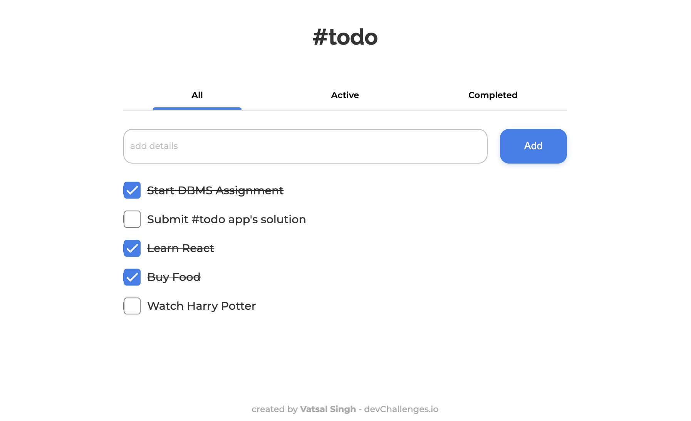
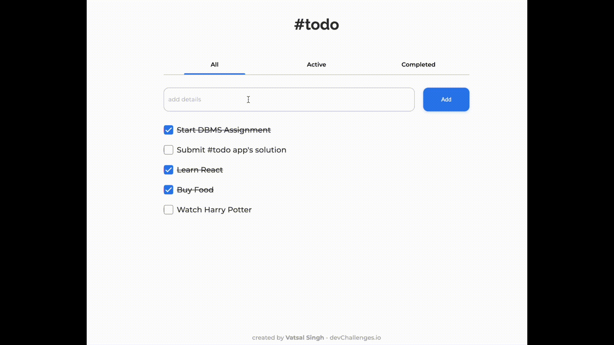

<!-- Please update value in the {}  -->

<h1 align="center"> 🚀 Todo App 🚀 </h1>


</div>

<!-- TABLE OF CONTENTS -->

## Table of Contents

- [Overview](#overview)
  - [Built With](#built-with)
- [Features](#features)
- [How to use](#how-to-use)


<!-- OVERVIEW -->

## Overview




Todo App. Maintain your tasks easily. Remembers everything. Switch between active, completed and all tasks.

- Where can I see your demo?
  [Live Demo](https://deb-todo-list.netlify.app/)

- What was your experience?
  It was amazing it's my first React app.

- What have you learned/improved?

  I've learned lot of stuff in this challenge:

  - How to use Sass with React

  - How to use CSS Modules to style React components

  - How to work with hooks like useState and useEffect

  - How to save data in browser's local storage

  ```js
  const loadTasks = () => {
  	const data = JSON.parse(localStorage['taskList']);
  	if (data.length) setTaskList(data);
  };

  const saveTasks = () => {
  	localStorage.setItem('taskList', JSON.stringify(taskList));
  };

  // Load tasks from local storage when app is launched
  useEffect(loadTasks, []);
  // Save tasks in local storage if tasks get changed (also run when it loads)
  useEffect(saveTasks, [taskList]);
  ```

### Built With

- [React](https://reactjs.org/)
- [React](https://sass-lang.com/)

## Features

- User can add a new task
- User can complete a task
- User can toggle between All, Active and Completed
- User can remove one or all tasks under the Completed tab
- User can delete completed tasks
- User can delete all the completed tasks at once
- App stores the data in local storage that when user refresh the page user can still see my progress

This application/site was created as a submission to a [DevChallenges](https://devchallenges.io/challenges) challenge. The [challenge](https://devchallenges.io/challenges/hH6PbOHBdPm6otzw2De5) was to build an application to complete the given user stories.

## How To Use

To clone and run this application, you'll need [Git](https://git-scm.com) and [Node.js](https://nodejs.org/en/download/) (which comes with [yarn](https://yarnpkg.com/)) installed on your computer. From your command line:

```bash
# Clone this repository
$ git clone https://github.com/debapriyo007/todo-list

# Install dependencies
$ yarn install

# Run the app
$ yarn start
```


